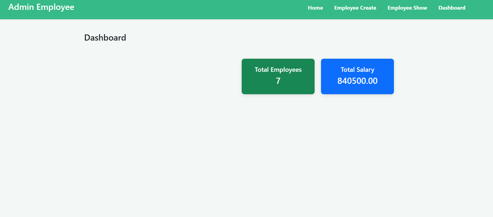
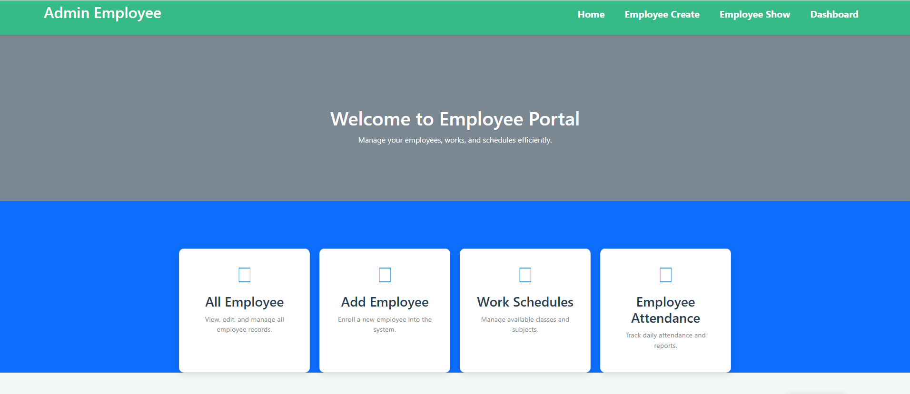
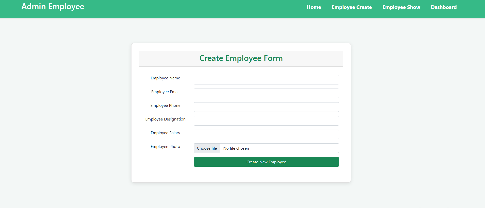
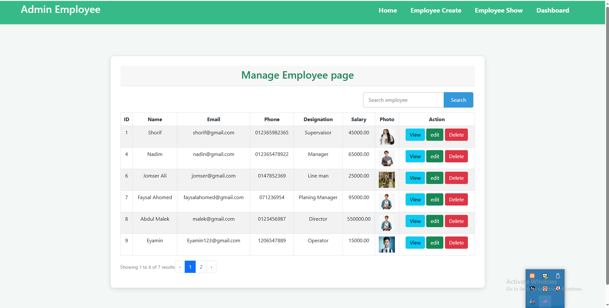

# Employee Management System (Laravel)

A complete Laravel CRUD application with image upload, search, pagination, and dashboard.

---

## Features

- ✅ Add New Employee
- ✅ View Employee List
- ✅ Update Employee Info
- ✅ Delete Employee
- ✅ Upload & Update Employee Photo
- ✅ Search Employee (by name & email)
- ✅ Pagination
- ✅ Employee Details Page
- ✅ Dashboard (Total Employees & Salary)

---

## Built With

- Laravel 11/12
- PHP
- MySQL
- Bootstrap 5

---

## Screenshots

### Dashboard


### Employee home


### Employee create


### Employee List


---

## Installation

1. Clone the repository:
```bash
git clone https://github.com/Jaynal-306/employee-management-system.git

2. Go to project folder:
cd employee-management-system

3.Install dependencies:
composer install

4.Copy .env file:
cp .env.example .env

5.Generate app key:
php artisan key:generate

6.Setup database and run migration:
php artisan migrate

7.Run server:
php artisan serve
